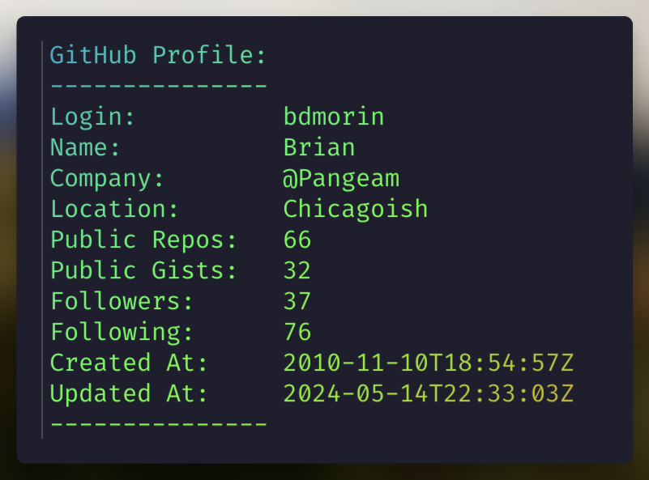

<div align="right">
    
    
</div>

# 👨‍💻 gh-userfetch

An extension for [GitHub CLI](https://github.com/cli/cli) to show your GitHub profile inspired by [sheepla/gh-userfetch](https://github.com/sheepla/gh-userfetch) .

The original was archived, so I'm just dipping my toes in the pool.



## Usage

Just run `gh userfetch` but needs authentication with GitHub host: `gh auth login`.

## Installation

Requires [GitHub CLI](https://github.com/cli/cli) v2.0.0+ and [busyloop/lolcat](https://github.com/busyloop/lolcat).

```bash
gh extension install bdmorin/gh-userfetch
```

## TODO

- [ ] look for different `lolcat` type commands
- [ ] show profile image 

## Contributing

GET OFF MAH LAWN!!
unless you have coookies. then you are welcome.
